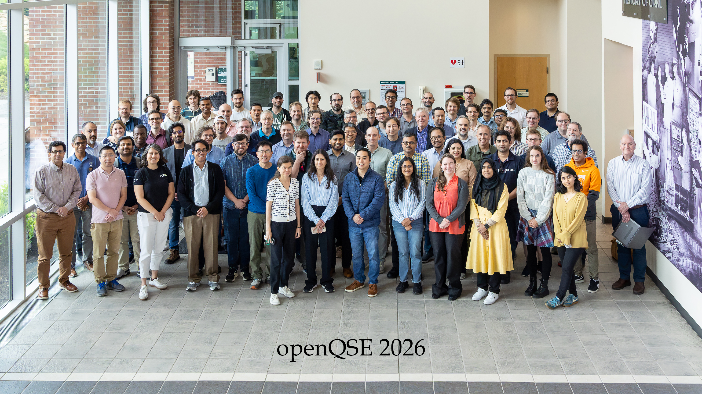

# OpenQSE 2026 Turns Collaboration into Action

*A conference day at Oak Ridge National Laboratory brought the quantum and high-performance computing communities together to shape an open, interoperable software ecosystem for scientific discovery.*

**July 24, 2026 | Oak Ridge, Tennessee**

The second annual Open Quantum-HPC Software Ecosystem (OpenQSE) workshop brought researchers, technology developers, and computing experts together at Oak Ridge National Laboratory for a day centered on a shared goal: making quantum processors useful as part of larger scientific computing environments.

Held on the final day of the 2026 Quantum Computing User Forum, the workshop reflected how far the community has come in one year. Early conversations about the barriers between quantum computing and high-performance computing have grown into a year-round collaboration with focused working groups, concrete milestones, and an emphasis on building technology together.

## Two keynotes set the stage

**Georgia Tourassi**, associate laboratory director for Computing and Computational Sciences at Oak Ridge National Laboratory, opened the day with a vision for a hybrid, quantum-centric HPC ecosystem built for scientific discovery. Her keynote emphasized that advances in hardware alone will not determine the impact of quantum computing. Open software, portable tools, common interfaces, and close co-design among application scientists, software teams, and hardware developers will be just as important.

In the second keynote, **Laura Schulz**, project lead for innovation at the Argonne Leadership Computing Facility at Argonne National Laboratory, widened the lens from individual systems to the ecosystem around them. She challenged the community to prepare the software, access models, workflows, support, and governance needed before early fault-tolerant quantum resources become broadly usable. Her message reinforced a central theme of the day: scientific value will come from connecting quantum, HPC, and AI resources in ways that work for real users across institutions.

## Four tracks, one connected ecosystem

Participants then moved into four parallel sessions covering **System Architecture, Software Architecture, Compilers, and the Quantum Resource Interface**. Although each group approached the challenge from a different layer of the technology stack, their discussions repeatedly converged on the need for shared language, practical interfaces, and testable workflows.

The **System Architecture** group considered how quantum processors, supercomputers, nearby classical resources, and specialized control systems can operate as parts of one scientific workflow. The conversation highlighted the importance of designing around real applications and the people who will use them.

The **Software Architecture** track was divided into two complementary areas: **control electronics** and **runtime**. The control-electronics discussion examined how a usable quantum system extends beyond the processor to include timing, calibration, measurement, and feedback. The runtime discussion explored how software can coordinate work across CPUs, GPUs, and QPUs while presenting users with a coherent experience. Together, the two sessions connected the fastest hardware-level interactions with the larger flow of a scientific application.

The **Compilers** group focused on portability. Its participants explored how software can translate among evolving programming tools and hardware platforms without forcing every project to rebuild the same connections. Rather than prescribing a single solution, the group emphasized reusable interfaces, shared testing, and room for innovation as fault-tolerant approaches mature.

The **Quantum Resource Interface** group looked at the practical work of making quantum systems available alongside established HPC resources. Scheduling, access, status, accounting, and operational support all emerged as essential parts of the user experience. The session underscored that interoperability is as much about operating systems reliably as it is about connecting software components.

## A community committed to the work

The workshop’s greatest strength was the range of people working side by side. Contributors from industry, academia, and national laboratories brought different platforms, use cases, and experiences to the same tables. Participants from organizations including ORNL, ANL, LBNL/NERSC, TUM, MQV, IBM, AMD, HPE, AWS, Alice & Bob, IonQ, Quantinuum, Qblox, DELL, NVIDIA, MQSC, Siemens, joined colleagues from other laboratories and universities to identify common ground and define next steps.

That collaborative approach is central to OpenQSE. The initiative is not seeking a solution owned by one institution or vendor. It is building a community around open, modular, and vendor-neutral technologies that can evolve with the field.

The day ended with more than a set of presentations. Working groups left with priorities to refine, prototypes to compare, documents to develop, and plans to continue meeting throughout the year. OpenQSE 2026 showed what becomes possible when a diverse community moves from discussing a shared challenge to building a shared foundation.

## Explore the workshop materials

View the complete collection of [OpenQSE 2026 meeting minutes and presentations](https://github.com/openQSE/Workshops/tree/main/OpenQSE-2026).
